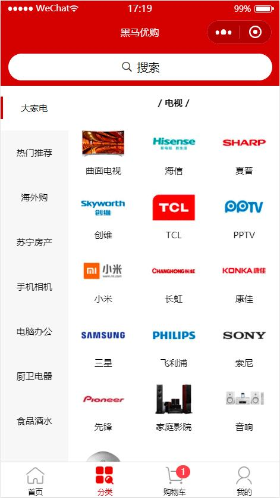
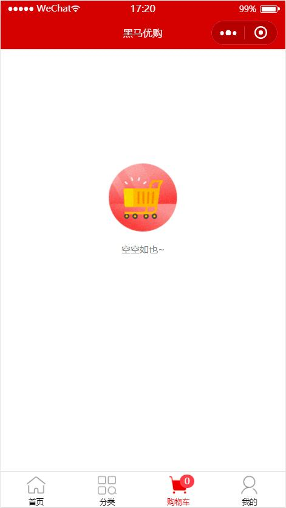
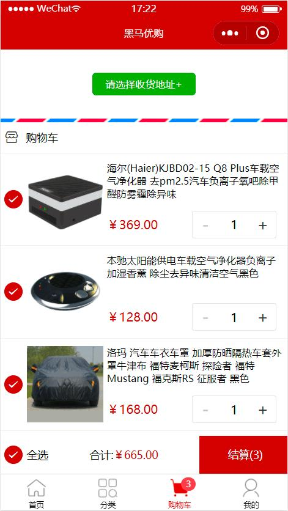
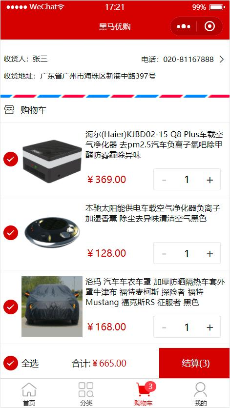
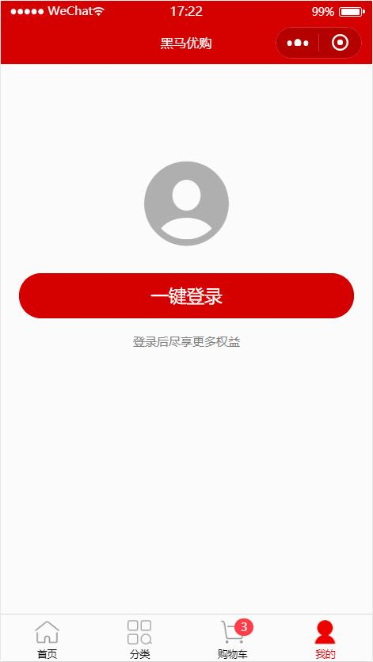
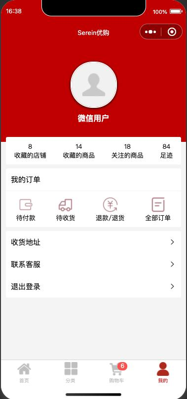

# Serein优购


## 项目说明

- 本项目使用 uni-app 进行开发，请使用 [HBuilder](https://hx.dcloud.net.cn/) 工具进行开发

- [在线文档请点击](https://www.escook.cn/docs-uni-shop)

- [uni-app 官方文档](https://uniapp.dcloud.net.cn/)

- [微信小程序开发文档](https://developers.weixin.qq.com/miniprogram/dev/framework/)


## 依赖包

1、数据接口

```bash
npm install @escook/request-miniprogram
```

## 项目截图

### 首页


### 分类页



### 购物车



### 我的





### 搜索页



### 商品详情


